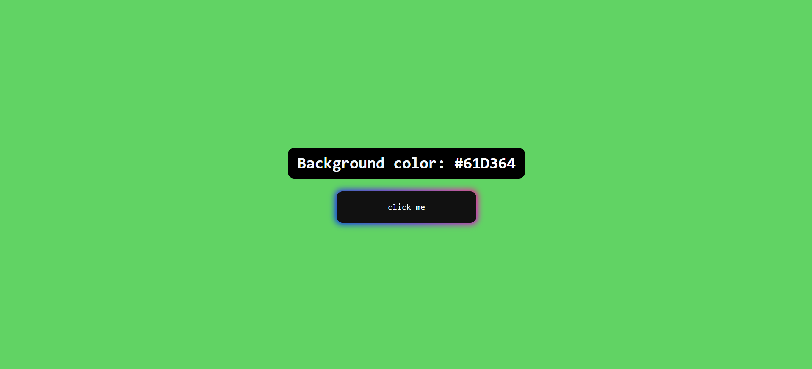

#Background Color

## Descrição do Projeto

Este é um projeto simples em HTML, CSS e JavaScript que permite aos usuários mudarem a cor de fundo da página com um clique em um botão. O botão é estilizado com efeitos visuais, e há uma área de exibição que mostra a cor atual em formato hexadecimal (#).

## Estrutura do Projeto

- `index.html`: Contém a estrutura HTML do projeto.
- `style.css`: Folha de estilos para estilizar os elementos.
- `script.js`: Script JavaScript para manipulação de eventos.

## Recursos Principais

- **Geração de Cores Aleatórias:** A cor de fundo é gerada aleatoriamente em formato hexadecimal.
- **Botão Estilizado:** O botão possui efeitos visuais atraentes e animações durante a interação.
- **Exibição Dinâmica:** A cor atual é exibida dinamicamente em formato hexadecimal.